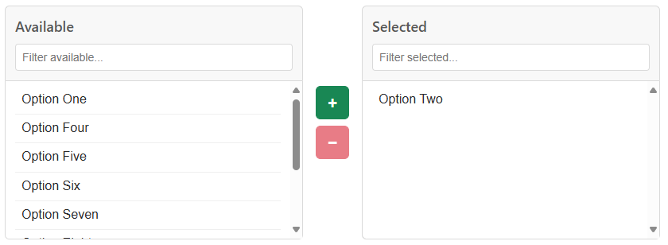

# multi-select-web-component

A web component styled with Bootstrap that offers a dual-pane multiselect widget with search filters.



## Usage

```html
<html>
    <head>
        ...
        <!--Make sure you defer the script so the <option>s load before the component is initialized-->
        <script defer type="text/javascript" src="/multiselect.js"></script>
    </head>
    <body>
        ...
        <form>
            <!--
                Provide a path to your Bootstrap 5 stylesheet. If not provided, uses CDN.
                To avoid a flash of unstyled content, set visibility to hidden.
                The component will make itself visible when initializing.
            -->
            <multi-select stylesheet="path/to/bootstrap.css" style="visibility: hidden">
                <!--If you'd like to customize the labels, use slots-->
                <span slot="available-label">📋 Available Options</span>
                <span slot="selected-label">✅ Selected Items</span>
                <option value="1">Option One</option>
                <option value="2" selected>Option Two</option>
                <option value="3">Option Three</option>
                <option value="4">Option Four</option>
                <option value="5">Option Five</option>
                <option value="6">Option Six</option>
            </multi-select>
            <button type="submit">Submit</button>
        </form>
        ...
    </body>
</html>
```

## Installation

1. Add `multiselect.js` to your site.
2. Link it in your page `<head>` with a `<script>` tag. Make sure to set `defer`.
3. Provide each instance of `<multi-select>` with a `stylesheet` prop containing a path to your Bootstrap 5 stylesheet. 
   - If not provided, uses CDN.
4. To avoid a flash of unstyled content, you can set `visibility` to `hidden`. The component will make itself visible when initializing.
5. If you'd like to customize the labels in each section, use the `available-label` and `selected-label` slots.